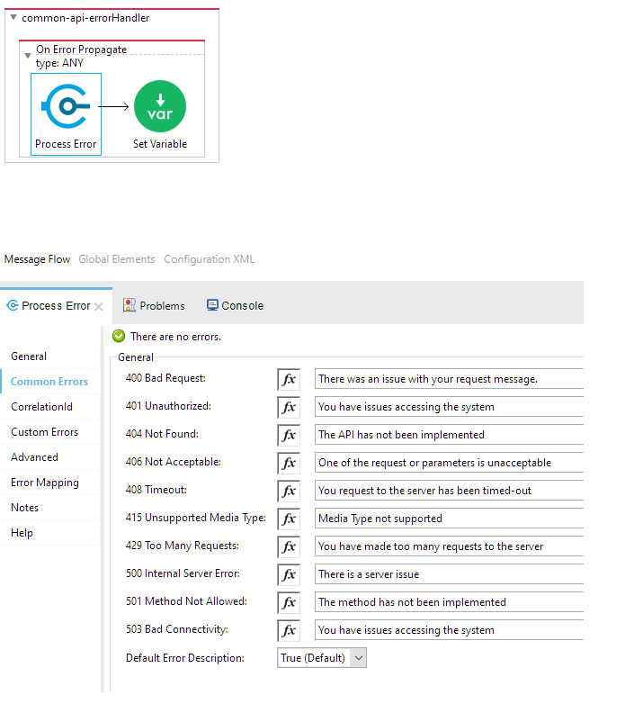
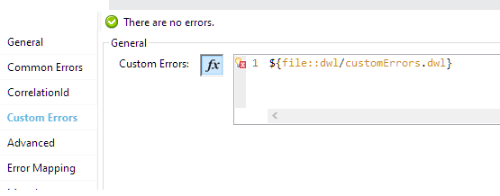

# Error Plugin for Mule 4

## Recent Changes

- Plugin can accept custom errors as a JSON or DW script.
- Standard errors are now part of Plugin. However, application can override any error using `customErrors`
- Added a test app to demo new functionalities


This custom error handler plugin allows a single module to process error messages from multiple types:
- Error types default to mule. (HTTP, APIKIT, Connectors based, etc)
- custom error types as defined by raise error component. 
- Un-clutter exceptions both in UI and XML
- User can change the custom error message (for multiple errors) in the UI rather than in the XML.
- Users intending to use other error types should put them on on-error-propagate or on-error-continue prior to using this module.
- No specific error type is required for this module. It can parse any error types.

## Operations Supported
On Error

## Deploying to Exchange
Clone the project to your local, change the groupId to point your orgId. Issue `mvn deploy`.

Ensure that there is an entry in your settings.xml pertaining to Exchange2

## Local Install
For local install, give any groupId. Issue `mvn clean install`

## Using the module in a Mule4 Project
Add this dependency to your application pom.xml

```
<dependency>
	<groupId>${groupId}</groupId>
	<artifactId>common-error-handler</artifactId>
	<version>${version}</version>
	<classifier>mule-plugin</classifier>
</dependency>
```

## Usage

- Delete the auto-generated error blocks (on-error-propagate/on-error-continue) before using this module.
- Place the plugin inside an error block (on-error-propagate/on-error-continue) along with a variable for httpStatus.


## Tabs

### General

- Takes values for apiName and apiVersion. Current default values will be read from a property file `api.name` and `api.version` respectively.
- Error section defines from what mule expression should the error be read.
- httpStatus set variable is required to send back the httpStatus on the http response

**httpStatus variable must be set for the http listener to return on the request**

### Common Errors
Common HTTP based errors are defined in this section. Users have to provide the message they want to send back on the API error response.



### Custom Errors 

Custom errors can be passed as JSON or DW Script
```
{
	"MULE:EXPRESSION": {
		"errorCode": 500,
		"reason": "UNKNOWN",
		"defaultError": error.description,
		"errorType": "MULE:EXPRESSION"
	},
	"UNKNOWN": {
		"errorCode": 500,
		"reason": "UNKNOWN",
		"defaultError": error.description,
		"errorType": "MULE:EXPRESSION"
	}
}
```
DW Function
```
/**
 * 
 * Function to construct error configuration
 */
fun customErrors(error) = {
	"MULE:EXPRESSION": {
		"errorCode": 500,
		"reason": "UNKNOWN",
		"defaultError": error.description,
		"errorType": "MULE:EXPRESSION"
	},
	"VALIDATION:INVALID_BOOLEAN": {
		"errorCode": 500,
		"reason": "UNKNOWN",
		"defaultError": error.description, // read error from the application
		"errorType": "VALIDATION:INVALID_BOOLEAN"
	}
}

```



### CorrelationId

A correlationId will be used for tracking transactions. The default value is #[correlationId]

## Sample Usage

### On Error With Default Errors
```
<error-handler>
	<on-error-propagate enableNotifications="true"
		logException="true" doc:name="On Error Propagate" doc:id="b995ec19-3b56-4b8e-8b0f-b172cead9be4">
		<error-handler-plugin:on-error doc:name="On error" doc:id="42db8478-b083-48b4-b31f-6638e6a6f18a" />
		<set-variable value="#[attributes.httpStatus]"
			doc:name="Set Variable" doc:id="2151ced0-a42f-4c0d-b439-455abd354277"
			variableName="httpStatus" />
	</on-error-propagate>
</error-handler>
```


## Contributors

Imtiyaz Qureshi, Salim Khan, Biswaranjan Mohanty
